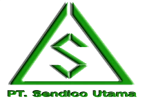

<div align="center">
  
</div>

# PT Sendico Utama - Digital Ecosystem 🏗️

Selamat datang di profil organisasi **PT Sendico Utama**. Kami fokus pada penyediaan solusi infrastruktur dan konstruksi baja modern. Repositori di organisasi ini mencakup seluruh ekosistem digital kami, mulai dari infrastruktur Backend hingga antarmuka pengguna (Frontend).

---

## 🏗️ Arsitektur Sistem

Sistem kami terbagi menjadi tiga pilar utama yang saling terintegrasi untuk mendukung operasional perusahaan secara digital:

- **Core API (Backend)**: Pusat kendali data dan logika bisnis
- **Admin Feature (Internal)**: Dashboard manajemen untuk operasional internal perusahaan
- **Company Profile (External)**: Wajah digital perusahaan untuk klien dan mitra

---

## 📂 Repositori Utama

### 1. RESTful API Sendico

Pusat kendali data menggunakan arsitektur REST yang dibangun dengan performa dan keamanan tinggi.

- **Tech Stack**: Node.js, TypeScript, Express.js, Prisma ORM, MySQL
- **Fitur Kunci**: 
  - Autentikasi berbasis token (X-API-TOKEN)
  - Validasi Zod
  - Sistem CRUD Posting & User
- **Role**: Melayani data untuk Admin Dashboard dan Web Profile

### 2. Admin Feature Dashboard

Platform internal bagi tim admin untuk mengelola konten web dan data pengguna secara efisien.

- **Tech Stack**: Next.js 16, Tailwind CSS 4, Flowbite, SweetAlert2
- **Fitur Kunci**: 
  - Manajemen User
  - Editor Blog
  - Manajemen Proyek (Posting)
  - Auth Guard
- **Target**: Penggunaan internal staf PT Sendico Utama

### 3. Company Profile Web

Website publik responsif yang menampilkan portofolio dan berita terbaru dari PT Sendico Utama.

- **Tech Stack**: Next.js 15, TypeScript, Lucide React, Flowbite
- **Fitur Kunci**: 
  - Katalog Proyek Dinamis
  - Carousel Galeri
  - Optimasi SEO
  - Integrasi News API
- **Target**: Klien potensial dan mitra bisnis

---

## 🛠️ Ringkasan Teknologi

| Komponen | Framework / Library | Database / ORM |
|----------|-------------------|----------------|
| Backend | Express.js, TypeScript | MySQL, Prisma |
| Admin Panel | Next.js 16, Flowbite | REST API Client |
| Landing Page | Next.js 15, Tailwind CSS | REST API Client |

---

## 🚦 Alur Integrasi Data

Sistem bekerja secara harmonis dengan alur sebagai berikut:

1. **Admin mengunggah** proyek atau berita baru melalui Admin Feature
2. **Data divalidasi dan disimpan** oleh RESTful API ke dalam database MySQL
3. **Company Profile secara otomatis** melakukan fetch data terbaru dari API untuk ditampilkan kepada pengunjung secara real-time

---

## 🚀 Cara Menjalankan Ekosistem secara Lokal

Untuk menjalankan seluruh ekosistem di mesin lokal Anda:

### Setup API
```bash
# Pastikan MySQL berjalan, konfigurasikan .env
npm run dev
# Berjalan di Port 3000
```

### Setup Admin
```bash
# Hubungkan ke API URL
npm run dev
# Berjalan di Port 3001
```

### Setup Company Profile
```bash
npm run dev
# Berjalan di Port 3002
```

---

## 👥 Kontribusi & Pemeliharaan

Seluruh proyek ini dikelola dan dipelihara secara aktif oleh tim IT PT Sendico Utama.

- **Maintained by**: Agung Maulana
- **Status**: Active Development
- **Copyright**: © 2026 PT Sendico Utama. All Rights Reserved.
